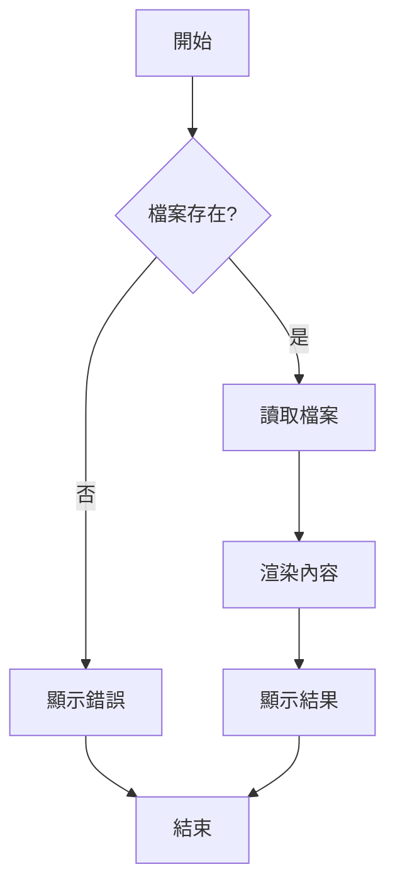
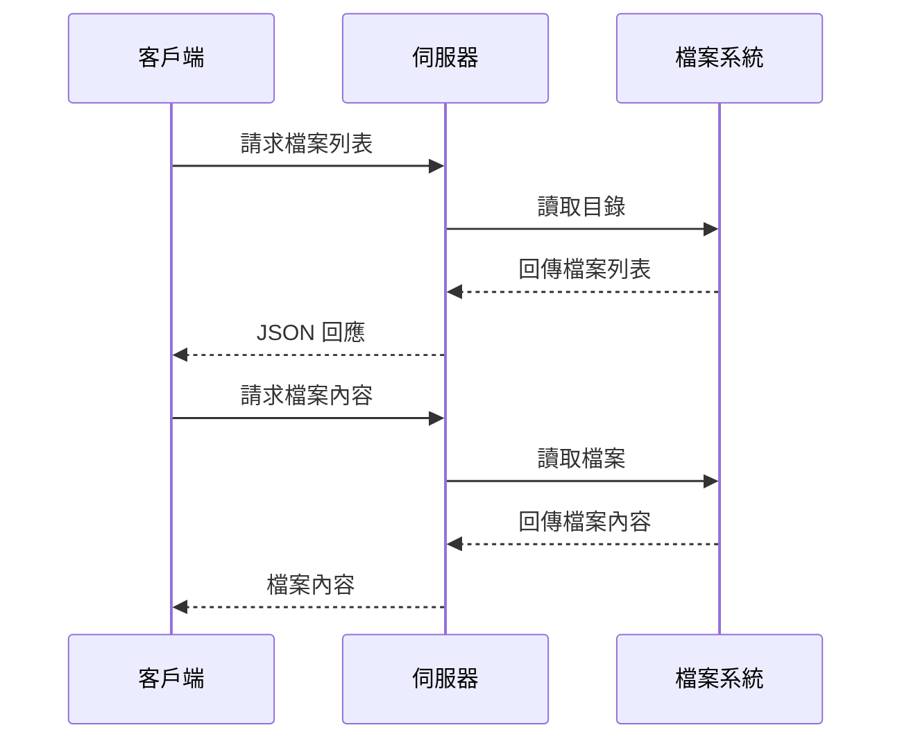
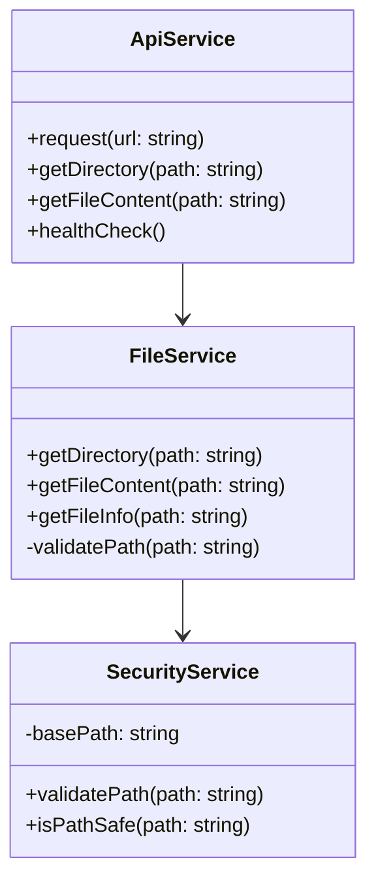
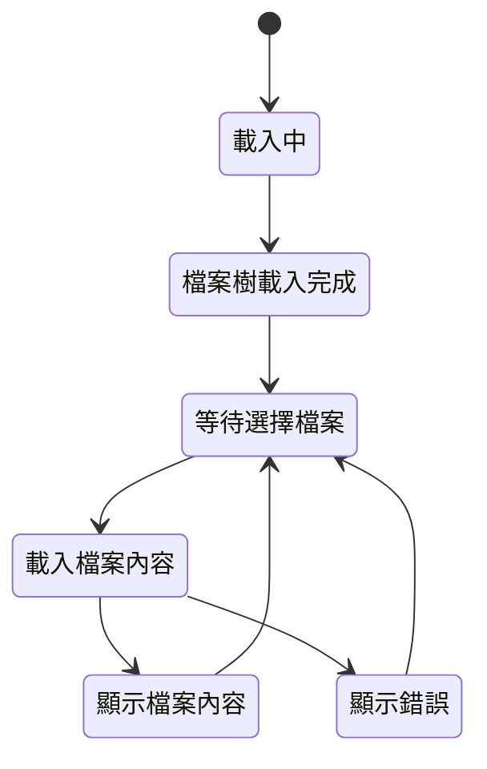
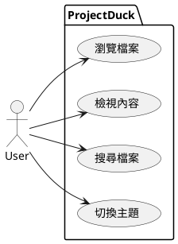
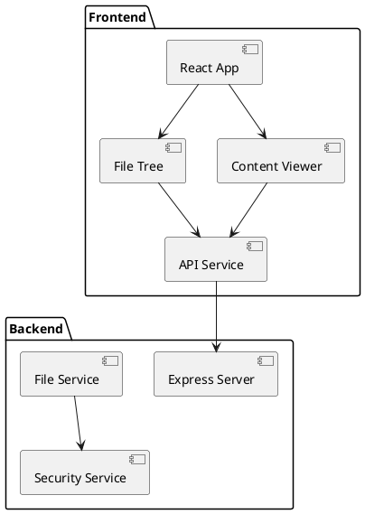
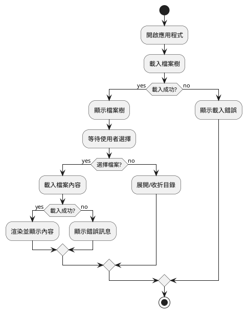

# 圖表示例

這個文件展示了各種圖表的使用方式。

## Mermaid 圖表

### 流程圖

```mermaid
graph TD
    A[開始] --> B{檔案存在?}
    B -->|是| C[讀取檔案]
    B -->|否| D[顯示錯誤]
    C --> E[渲染內容]
    E --> F[顯示結果]
    D --> G[結束]
    F --> G
```

### 時序圖

```mermaid
sequenceDiagram
    participant C as 客戶端
    participant S as 伺服器
    participant F as 檔案系統
    
    C->>S: 請求檔案列表
    S->>F: 讀取目錄
    F-->>S: 回傳檔案列表
    S-->>C: JSON 回應
    
    C->>S: 請求檔案內容
    S->>F: 讀取檔案
    F-->>S: 回傳檔案內容
    S-->>C: 檔案內容
```

### 類別圖

```mermaid
classDiagram
    class FileService {
        +getDirectory(path: string)
        +getFileContent(path: string)
        +getFileInfo(path: string)
        -validatePath(path: string)
    }
    
    class SecurityService {
        +validatePath(path: string)
        +isPathSafe(path: string)
        -basePath: string
    }
    
    class ApiService {
        +request(url: string)
        +getDirectory(path: string)
        +getFileContent(path: string)
        +healthCheck()
    }
    
    FileService --> SecurityService
    ApiService --> FileService
```

### 狀態圖

```mermaid
stateDiagram-v2
    [*] --> 載入中
    載入中 --> 檔案樹載入完成
    檔案樹載入完成 --> 等待選擇檔案
    等待選擇檔案 --> 載入檔案內容
    載入檔案內容 --> 顯示檔案內容
    顯示檔案內容 --> 等待選擇檔案
    載入檔案內容 --> 顯示錯誤
    顯示錯誤 --> 等待選擇檔案
```

## PlantUML 圖表

### 用例圖

```plantuml
@startuml
left to right direction
actor User as U
package "ProjectDuck" {
  usecase "瀏覽檔案" as UC1
  usecase "檢視內容" as UC2
  usecase "搜尋檔案" as UC3
  usecase "切換主題" as UC4
}

U --> UC1
U --> UC2
U --> UC3
U --> UC4
@enduml
```

### 元件圖

```plantuml
@startuml
package "Frontend" {
  component "React App" as APP
  component "File Tree" as TREE
  component "Content Viewer" as VIEWER
  component "API Service" as API
}

package "Backend" {
  component "Express Server" as SERVER
  component "File Service" as FS
  component "Security Service" as SS
}

APP --> TREE
APP --> VIEWER
API --> SERVER
FS --> SS
VIEWER --> API
TREE --> API
@enduml
```

### 活動圖

```plantuml
@startuml
start
:開啟應用程式;
:載入檔案樹;
if (載入成功?) then (yes)
  :顯示檔案樹;
  :等待使用者選擇;
  if (選擇檔案?) then (yes)
    :載入檔案內容;
    if (載入成功?) then (yes)
      :渲染並顯示內容;
    else (no)
      :顯示錯誤訊息;
    endif
  else (no)
    :展開/收折目錄;
  endif
else (no)
  :顯示載入錯誤;
endif
stop
@enduml
```

---

**注意**: 圖表渲染功能可能需要額外的配置才能正確顯示。